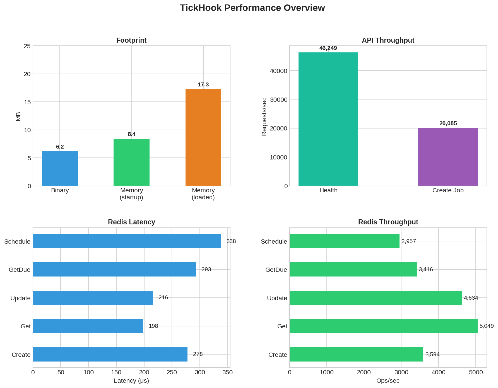

# TickHook

[](https://github.com/cr0hn/tickhook/actions?query=workflow%3ACI)
[](https://goreportcard.com/report/github.com/cr0hn/tickhook)
[](https://pkg.go.dev/github.com/cr0hn/tickhook)
[](https://opensource.org/licenses/MIT)
[](https://github.com/cr0hn/tickhook/pkgs/container/tickhook)

**Execute HTTP calls at specific times, at scale, without the complexity.**

A self-hosted webhook scheduler. Single binary. Redis backend. Nothing else.

## The Problem

You start with simple needs:

- "Send this email tomorrow at 8:00 AM"
- "Call this endpoint every 6 hours"
- "Fire a reminder in 15 minutes"
- "Refresh this data daily at midnight"

So you use `cron`, a `sleep()`, or poll your database. It works... until it doesn't:

- Users create schedules dynamically (not static cron jobs)
- You need persistence across restarts and deployments
- You want consistent retries with backoff
- You need to avoid hammering external APIs (rate limits)
- You want something simple to operate

**TickHook solves this**: schedule webhooks with an API, and they fire when the time comes.

## What TickHook Is

A service that exposes an API to create scheduled tasks (one-shot or recurring) and executes an HTTP webhook when the time arrives.

```
Your App  →  POST /v1/jobs/one-shot  →  TickHook stores in Redis
                                              ↓
                                        Time arrives
                                              ↓
                                        TickHook fires webhook → Your endpoint
```

## What TickHook Is NOT

- **Not a workflow engine** — no steps, conditions, or branching
- **Not distributed cron** — no complex cron expressions
- **Not a general job queue** — doesn't execute arbitrary code
- **Not exactly-once** — at-least-once delivery (make receivers idempotent)

TickHook is deliberately small: timestamps, intervals, HTTP. That's it.

## Use Cases

| Scenario | Example |
|----------|---------|
| **Scheduled notifications** | "Send newsletter daily at user's preferred time" |
| **Drip campaigns** | "Email 1 now, Email 2 tomorrow 8 AM, Email 3 in 3 days" |
| **Retry failed integrations** | "Webhook failed? Retry in 5 minutes with backoff" |
| **Expirations** | "Revoke access token at midnight" |
| **Reminders** | "Notify user 30 minutes before event" |
| **Periodic syncs** | "Call sync endpoint every hour" |

## Quick Start

### 1. Start Redis

```bash
docker run -d --name redis -p 6379:6379 redis:7-alpine
```

### 2. Run TickHook

```bash
# Docker
docker run -d -p 8080:8080 ghcr.io/cr0hn/tickhook:latest \
  --redis-url redis://host.docker.internal:6379 \
  --auth-token my-secret-token

# Or binary
./tickhook --redis-url redis://localhost:6379 --auth-token my-secret-token
```

### 3. Schedule Your First Webhook

**One-shot** — fires once at a specific time:

```bash
curl -X POST http://localhost:8080/v1/jobs/one-shot \
  -H "Authorization: Bearer my-secret-token" \
  -H "Content-Type: application/json" \
  -d '{
    "execute_at": "2026-01-15T10:00:00Z",
    "webhook": {
      "url": "https://your-api.com/webhook",
      "method": "POST",
      "headers": {"X-Custom-Header": "my-value"},
      "body": {"event": "reminder", "user_id": 123}
    }
  }'
```

**Recurring** — fires every N milliseconds:

```bash
curl -X POST http://localhost:8080/v1/jobs/recurring \
  -H "Authorization: Bearer my-secret-token" \
  -H "Content-Type: application/json" \
  -d '{
    "start_at": "2026-01-15T00:00:00Z",
    "interval_ms": 86400000,
    "webhook": {
      "url": "https://your-api.com/daily-sync",
      "method": "POST"
    }
  }'
```

### 4. Manage Jobs

```bash
# Get job status
curl http://localhost:8080/v1/jobs/{job_id} \
  -H "Authorization: Bearer my-secret-token"

# Cancel a job
curl -X DELETE http://localhost:8080/v1/jobs/{job_id} \
  -H "Authorization: Bearer my-secret-token"
```

## Receiving Webhooks

When TickHook fires a webhook, your endpoint receives:

### HTTP Request

```http
POST /your-endpoint HTTP/1.1
Host: your-api.com
Content-Type: application/json
X-Job-Id: 550e8400-e29b-41d4-a716-446655440000
Idempotency-Key: 550e8400-e29b-41d4-a716-446655440000
X-Custom-Header: my-value

{"event": "reminder", "user_id": 123}
```

### What Your Endpoint Receives

| Component | Description |
|-----------|-------------|
| **Method** | The HTTP method you specified (`POST`, `GET`, etc.) |
| **URL** | Your endpoint URL |
| **Headers** | Your custom headers + automatic TickHook headers |
| **Body** | The exact JSON body you provided when creating the job |

### Automatic Headers

TickHook adds these headers to every webhook (cannot be overridden):

| Header | Value | Purpose |
|--------|-------|---------|
| `X-Job-Id` | UUID | Unique job identifier |
| `Idempotency-Key` | UUID (same as X-Job-Id) | For deduplication |
| `Content-Type` | `application/json` | When body is present |

### Example Receiver (Node.js)

```javascript
app.post('/webhook', (req, res) => {
  const jobId = req.headers['x-job-id'];
  const idempotencyKey = req.headers['idempotency-key'];

  // Check if already processed (idempotency)
  if (await alreadyProcessed(idempotencyKey)) {
    return res.status(200).json({ status: 'already_processed' });
  }

  // Process the webhook
  const { event, user_id } = req.body;
  await processEvent(event, user_id);

  // Mark as processed
  await markProcessed(idempotencyKey);

  res.status(200).json({ status: 'ok' });
});
```

### Response Handling

| Your Response | TickHook Action |
|---------------|-----------------|
| 2xx | Success — job completes |
| 5xx, 429 | Retry with exponential backoff |
| 4xx (except 429) | Fail immediately — no retry |
| Timeout / network error | Retry with backoff |

## How It Works

TickHook maintains a time-ordered list of jobs in Redis:

1. **Every 200ms**, it checks: "which jobs are due now?"
2. **Executes them in parallel**, respecting concurrency limits
3. **On success**: one-shot jobs are deleted, recurring jobs schedule the next run
4. **On failure**: retries with exponential backoff

### Job Types

| Type | Behavior |
|------|----------|
| **One-shot** | Executes once, deleted on success, kept on failure for inspection |
| **Recurring** | Executes repeatedly at fixed intervals, always schedules next run |

### Retry Logic

Backoff: `base_ms * 2^(attempt-1)` + random jitter (0-250ms), capped at 10 minutes.

### Concurrency Control

TickHook prevents overwhelming external APIs:

- `--max-inflight`: Total concurrent webhooks (default: 200)
- `--max-per-domain`: Per destination domain (default: 5)

## Installation

### Docker (Recommended)

```bash
docker pull ghcr.io/cr0hn/tickhook:latest
```

### Pre-built Binaries

Download from [GitHub Releases](https://github.com/cr0hn/tickhook/releases):

```bash
# Linux
wget https://github.com/cr0hn/tickhook/releases/latest/download/tickhook-linux-amd64

# macOS
wget https://github.com/cr0hn/tickhook/releases/latest/download/tickhook-darwin-arm64

# Windows
Invoke-WebRequest -Uri https://github.com/cr0hn/tickhook/releases/latest/download/tickhook-windows-amd64.exe -OutFile tickhook.exe
```

### From Source

```bash
git clone https://github.com/cr0hn/tickhook.git
cd tickhook
go build -o tickhook ./cmd/tickhook
```

## Configuration

### CLI Flags

| Flag | Required | Default | Description |
|------|----------|---------|-------------|
| `--redis-url` | Yes | — | Redis connection URL |
| `--auth-token` | Yes | — | Bearer token for API authentication |
| `--bind` | No | `0.0.0.0:8080` | HTTP server bind address |
| `--namespace` | No | `tickhook` | Redis key prefix |
| `--poll-ms` | No | `200` | How often to check for due jobs (ms) |
| `--batch` | No | `200` | Max jobs to fetch per poll |
| `--max-inflight` | No | `200` | Max concurrent webhook executions |
| `--max-per-domain` | No | `5` | Max concurrent per destination domain |
| `--default-timeout-ms` | No | `5000` | Default webhook timeout (ms) |
| `--log-level` | No | `info` | Log verbosity (debug, info, warn, error) |

### Docker Compose Example

```yaml
version: '3.8'
services:
  redis:
    image: redis:7-alpine
    ports:
      - "6379:6379"

  tickhook:
    image: ghcr.io/cr0hn/tickhook:latest
    ports:
      - "8080:8080"
    command: >
      --redis-url redis://redis:6379
      --auth-token your-secret-token
      --max-inflight 500
      --max-per-domain 10
    depends_on:
      - redis
```

## Performance

<p align="center">
  
</p>

| Metric | Value |
|--------|-------|
| Binary size | 6.2 MB |
| Memory (idle) | ~8 MB |
| Memory (under load) | ~17 MB |
| API throughput | 46,000 req/s |
| Job creation rate | 20,000 req/s |

## Guarantees and Limitations

### What TickHook Guarantees

- **Persistence**: Jobs survive process restarts (stored in Redis)
- **Retries**: Failed webhooks retry with exponential backoff
- **Concurrency control**: Won't overwhelm your targets

### V1 Limitations

- **Single consumer**: One process instance (no HA yet)
- **At-least-once**: Webhooks may fire more than once — receivers must be idempotent
- **No cron expressions**: Only fixed intervals (every N ms)
- **UTC only**: All times in UTC, handle timezone conversion client-side
- **Crash window**: If the process dies between claiming and executing a job, that job may be lost

### V2 Roadmap

- High availability with lease-based job claiming
- Prometheus metrics endpoint
- Multiple consumer support

## API Reference

All endpoints require `Authorization: Bearer <token>`.

| Method | Endpoint | Description |
|--------|----------|-------------|
| POST | `/v1/jobs/one-shot` | Create one-shot job |
| POST | `/v1/jobs/recurring` | Create recurring job |
| GET | `/v1/jobs/{job_id}` | Get job details |
| DELETE | `/v1/jobs/{job_id}` | Cancel/delete job |
| GET | `/health` | Health check (no auth) |

See [docs/API.md](docs/API.md) for complete request/response examples.

## Documentation

- [API Reference](docs/API.md) — Complete endpoint documentation
- [Architecture](docs/ARCHITECTURE.md) — System design and internals
- [Deployment](docs/DEPLOYMENT.md) — Docker, Kubernetes, systemd guides
- [Internals](docs/INTERNALS.md) — Redis data model, execution details

## Why Not Just Use...

### Cron?

Cron works for static, hand-defined jobs. TickHook handles dynamic, user-created schedules at scale with retries and concurrency control.

### Postgres polling?

Works initially, but contention grows with scale. Redis ZSET provides efficient time-based queries with minimal overhead.

### Celery/Sidekiq?

Those are general job queues requiring workers that execute code. TickHook only fires HTTP — your code runs on the receiving end.

## License

MIT License. See [LICENSE](LICENSE).
