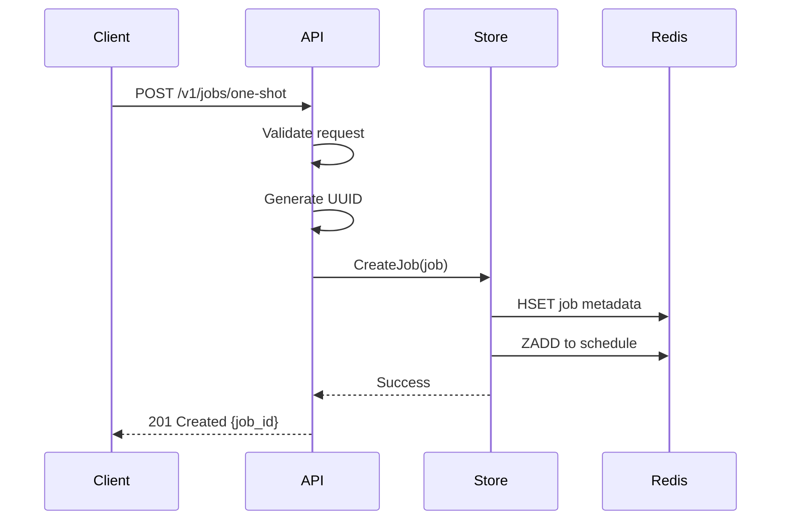
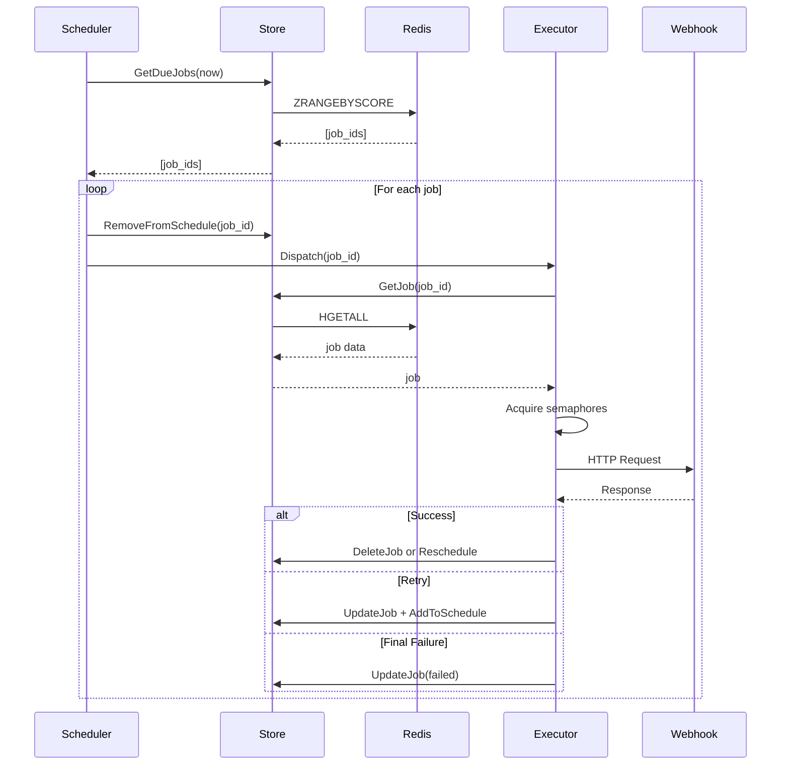

# TickHook Architecture & Design

## Table of Contents

- [Overview](#overview)
- [System Architecture](#system-architecture)
- [Core Components](#core-components)
- [Data Flow](#data-flow)
- [Design Decisions](#design-decisions)
- [Concurrency Model](#concurrency-model)
- [Failure Handling](#failure-handling)
- [Performance Considerations](#performance-considerations)
- [Security Model](#security-model)
- [Future Considerations](#future-considerations)

## Overview

TickHook is designed as a single-binary webhook scheduler with a focus on simplicity, reliability, and operational ease. The architecture follows a modular monolith pattern where all components run within a single process but maintain clear boundaries and interfaces.

## System Architecture

```
┌─────────────────────────────────────────────────────────────────┐
│                        TickHook Process                         │
├─────────────────────────────────────────────────────────────────┤
│                                                                 │
│  ┌──────────────┐    ┌──────────────┐    ┌──────────────┐      │
│  │  HTTP API    │    │  Scheduler   │    │   Executor   │      │
│  │   Server     │    │    Loop      │    │  Worker Pool │      │
│  └──────┬───────┘    └──────┬───────┘    └──────┬───────┘      │
│         │                   │                   │               │
│         └───────────────────┼───────────────────┘               │
│                             │                                   │
│                    ┌────────▼────────┐                         │
│                    │   Redis Store   │                         │
│                    └─────────────────┘                         │
└─────────────────────────────────────────────────────────────────┘
```

### Component Responsibilities

1. **HTTP API Server**: Handles external requests for job management
2. **Scheduler Loop**: Polls Redis for due jobs and dispatches them
3. **Executor Worker Pool**: Executes webhooks with concurrency control
4. **Redis Store**: Provides persistence and scheduling primitives

## Core Components

### HTTP API Server (`internal/httpapi`)

The API server provides RESTful endpoints for job management:

- **Authentication**: Bearer token validation middleware
- **Request Validation**: Input validation at the edge
- **Response Format**: Consistent JSON responses with error codes
- **Server Identity**: All responses include `Server: TickHook/1.0` header

**Key Files**:
- `server.go`: HTTP server setup and lifecycle
- `middleware.go`: Auth, logging, and header middleware
- `handlers.go`: Request handlers for each endpoint

### Scheduler (`internal/scheduler`)

The scheduler implements a polling-based approach:

```go
for {
    jobs := store.GetDueJobs(now, batch)
    for _, job := range jobs {
        store.RemoveFromSchedule(job)  // V1: crash window here
        executor.Dispatch(job)
    }
    sleep(pollInterval)
}
```

**Design Choices**:
- Polling instead of blocking operations for simplicity
- Batch fetching to reduce Redis round trips
- Simple crash semantics (at-least-once delivery)

### Executor (`internal/executor`)

The executor manages webhook execution with sophisticated concurrency control:

```go
type Executor struct {
    globalSem    chan struct{}       // Global inflight limit
    domainSems   map[string]chan    // Per-domain limits
    jobQueue     chan string         // Job dispatch queue
    workers      []*Worker           // Worker goroutines
}
```

**Features**:
- Two-tier semaphore system (global + per-domain)
- Domain extraction and normalization
- Automatic header injection (`X-Job-Id`, `Idempotency-Key`)
- Timeout enforcement per request

### Store (`internal/store`)

The store layer provides an abstraction over Redis:

```go
type Store interface {
    CreateJob(ctx, job) error
    GetJob(ctx, id) (*Job, error)
    UpdateJob(ctx, job) error
    DeleteJob(ctx, id) error
    GetDueJobs(ctx, nowMs, limit) ([]string, error)
    RemoveFromSchedule(ctx, id) error
    AddToSchedule(ctx, id, dueAtMs) error
}
```

**Redis Data Structures**:
- ZSET `{namespace}:schedules`: Job scheduling (score = due_at_ms)
- HASH `{namespace}:job:{id}`: Job metadata

## Data Flow

### Job Creation Flow



### Job Execution Flow



## Design Decisions

### 1. Polling vs Event-Driven

**Decision**: Use polling with configurable interval (default 200ms)

**Rationale**:
- Simpler implementation and debugging
- Predictable load on Redis
- No risk of missed events
- Easy to implement batching

**Trade-off**: Higher latency (up to poll interval)

### 2. Single Process (V1)

**Decision**: Run as a single process without HA

**Rationale**:
- Dramatically simpler implementation
- No distributed locking complexity
- Clear crash semantics
- Suitable for many use cases

**Trade-off**: Single point of failure

### 3. At-Least-Once Delivery

**Decision**: Accept potential duplicate deliveries

**Rationale**:
- Avoids complex exactly-once protocols
- Webhooks should be idempotent anyway
- Automatic idempotency headers help receivers

### 4. Time-Based Scheduling Only

**Decision**: Use absolute timestamps, no cron expressions

**Rationale**:
- Simpler mental model
- No DST/timezone complexity
- Predictable behavior
- Cron can be layered on top if needed

### 5. Bearer Token Authentication

**Decision**: Simple bearer token, no OAuth/JWT

**Rationale**:
- Minimal external dependencies
- Simple to operate
- Sufficient for internal/trusted environments
- Can add more sophisticated auth later

## Concurrency Model

### Global Concurrency Limit

Prevents system overload:
```go
globalSem := make(chan struct{}, maxInflight)

// Acquire
globalSem <- struct{}{}
defer func() { <-globalSem }()
```

### Per-Domain Concurrency Limit

Prevents overwhelming individual destinations:
```go
domainSems[domain] = make(chan struct{}, maxPerDomain)
```

### Worker Pool Pattern

Fixed number of workers process jobs from a queue:
```go
for i := 0; i < maxInflight; i++ {
    go worker(jobQueue)
}
```

## Failure Handling

### Retryable Failures

- Network errors
- HTTP 5xx responses
- HTTP 429 (Rate Limit)

**Strategy**: Exponential backoff with jitter
```
delay = min(base * 2^(attempt-1), maxDelay) + jitter(0, 250ms)
```

### Non-Retryable Failures

- HTTP 4xx responses (except 429)
- Invalid webhook configuration

**Strategy**: Immediate failure, job marked as failed

### Crash Recovery (V1 Limitations)

**Current State**: Jobs can be lost if crash occurs between:
1. ZREM from schedule
2. Completion of execution

**Mitigation**: Document limitation, design for V2 with lease-based claiming

## Performance Considerations

### Redis Operations

**Optimizations**:
- Batch fetching (configurable batch size)
- Pipeline operations where possible
- Minimal round trips per job

**Key Operations**:
- `ZRANGEBYSCORE`: O(log(N) + M) where M is result size
- `HGETALL`: O(N) where N is field count
- `ZADD`/`ZREM`: O(log(N))

### HTTP Client

**Configuration**:
- Single shared `http.Client` instance
- Per-request timeout via context
- Connection pooling by default

### Memory Usage

**Bounded by**:
- Max inflight jobs (goroutines + buffers)
- Domain semaphore map (grows with unique domains)
- Job queue buffer size

**Estimate**: ~1-2KB per inflight job

### CPU Usage

**Primary consumers**:
- JSON serialization/deserialization
- TLS handshakes for HTTPS webhooks
- Goroutine scheduling

## Security Model

### API Security

- **Authentication**: Bearer token required for all API calls
- **Authorization**: Single-tenant, token grants full access
- **Transport**: Recommend TLS termination at load balancer

### Webhook Execution

- **Timeouts**: Configurable per-job timeout
- **Headers**: User headers cannot override TickHook headers
- **Retry Limits**: Bounded retry attempts prevent infinite loops

### Redis Security

- **Namespacing**: All keys prefixed with configurable namespace
- **Authentication**: Support for Redis AUTH via URL
- **TLS**: Support for `rediss://` URLs

### Operational Security

- **No Secrets in Logs**: Tokens and sensitive data excluded
- **Structured Logging**: Consistent format for log aggregation
- **Health Check**: Unauthenticated endpoint for monitoring

## Future Considerations

### V2: High Availability

**Planned Approach**:
```lua
-- Atomic claim with lease
local jobs = redis.call('ZRANGEBYSCORE', ...)
for _, job in ipairs(jobs) do
    redis.call('ZADD', 'running', lease_expiry, job)
    redis.call('ZREM', 'schedules', job)
end
return jobs
```

### Observability Enhancements

- Prometheus metrics endpoint
- OpenTelemetry tracing
- Job execution history
- Webhook response logging

### Feature Extensions

- Cron expression support (layer on top)
- Webhook retry strategies (linear, custom)
- Job dependencies/chains
- Conditional execution based on response
- Bulk job operations

### Scalability Improvements

- Connection pooling to Redis
- Horizontal scaling with consistent hashing
- Read replicas for job queries
- Webhook response caching

## Conclusion

TickHook's architecture prioritizes simplicity and operational ease while providing reliable webhook scheduling. The modular design allows for future enhancements without fundamental restructuring, and the clear component boundaries facilitate testing and maintenance.

The V1 limitations are intentional trade-offs that keep the system simple while serving a wide range of use cases. The path to V2 with high availability is clear and can be implemented when needed without breaking changes to the API.